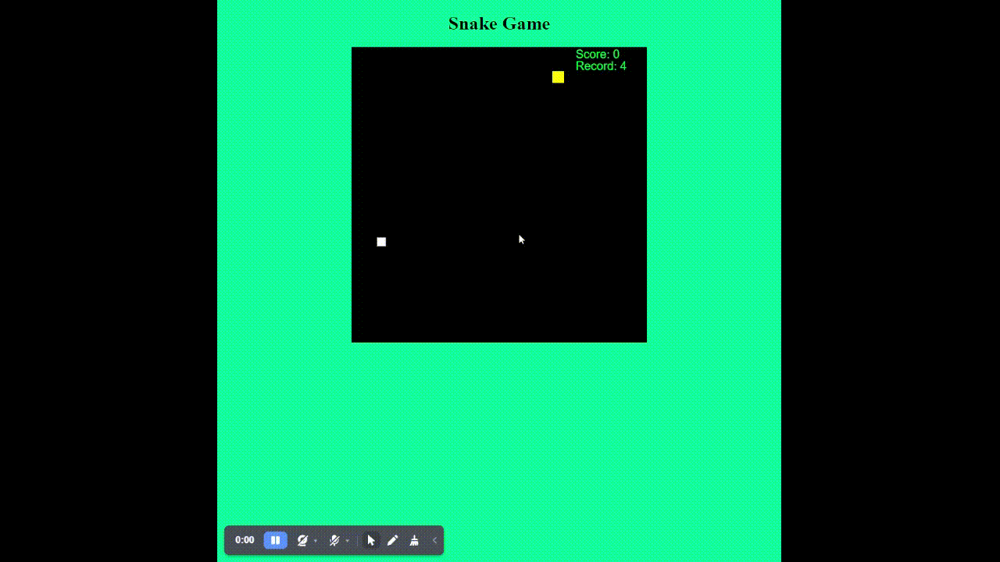

### README Atualizado para o Projeto Snake em JavaScript

---

#### Sobre o Projeto

Este é um jogo de snake simples escrito em JavaScript. Ele usa o elemento canvas do HTML5 para desenhar o jogo. O projeto foi originalmente inspirado por um vídeo no YouTube, mas foi estendido e agora está disponível no GitHub.



---

#### Como Baixar e Rodar o Projeto

1. **Clone o Repositório**

   ```bash
   git clone https://github.com/billyfranklim1/snake_js.git
   ```

2. **Navegue até o Diretório do Projeto**

   ```bash
   cd snake_js
   ```

3. **Abra o Arquivo `index.html` no Navegador**

   Você pode simplesmente arrastar e soltar o arquivo `index.html` em um navegador da web ou usar um servidor web local para servir o arquivo.

4. **Jogue o Jogo**

   Use as setas do teclado para controlar a cobra. O jogo aumentará de velocidade à medida que você come mais frutas.

---

#### Estrutura do Código

- `index.html`: Contém a estrutura básica do jogo e o elemento canvas.
- `game.js`: Contém toda a lógica do jogo, incluindo a movimentação da cobra e a detecção de colisões.
  
---

Espero que você se divirta jogando este jogo de snake! 🐍

---
